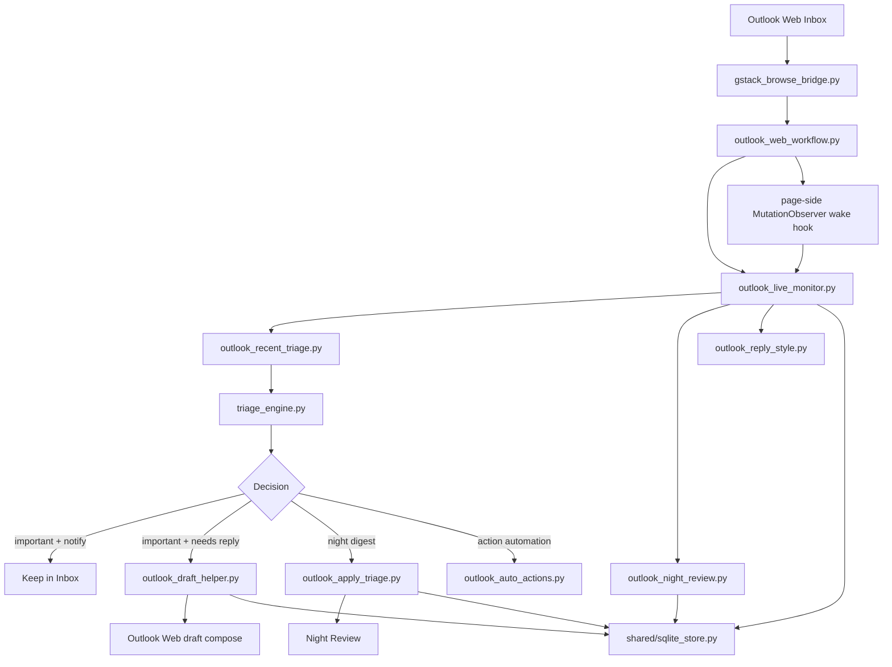

# Architecture

This project is now browser-first and SQLite-only for runtime state.

The active production path is:

- `Outlook Web`
- `gstack-browse` bridge for browser control
- local monitor for recent-mail triage
- Codex-backed per-message judgment
- direct Outlook Web actions for move / mark-read / draft
- SQLite as the primary runtime store

`Mail.app`, Gmail API, and Atlas are no longer part of the main execution path.
They remain fallback or debugging paths only.

## High-Level Flow

## Main Components

- [`browser/gstack_browse_bridge.py`](/Users/tianhao/Downloads/email-triage/browser/gstack_browse_bridge.py)
  Runs a stable tmux-hosted `gstack-browse` server and exposes a practical control channel for Outlook Web.

- [`browser/outlook_web_workflow.py`](/Users/tianhao/Downloads/email-triage/browser/outlook_web_workflow.py)
  Restores the Outlook session from Chrome `Profile 1` and provides a clean browser/session entry point.

- [`browser/outlook_live_monitor.py`](/Users/tianhao/Downloads/email-triage/browser/outlook_live_monitor.py)
  The long-running monitor. It polls recent Inbox rows, detects new mail, classifies it, and applies actions.

- [`browser/outlook_recent_triage.py`](/Users/tianhao/Downloads/email-triage/browser/outlook_recent_triage.py)
  Extracts visible Inbox rows, builds stable row identities, and packages messages for triage.

- [`shared/triage_engine.py`](/Users/tianhao/Downloads/email-triage/shared/triage_engine.py)
  Combines broad local rules with Codex-backed per-message judgment. Rules are advisory; final judgment comes from reading the message.

- [`browser/outlook_apply_triage.py`](/Users/tianhao/Downloads/email-triage/browser/outlook_apply_triage.py)
  Executes Outlook Web actions such as mark-read and move-to-folder.

- [`browser/outlook_draft_helper.py`](/Users/tianhao/Downloads/email-triage/browser/outlook_draft_helper.py)
  Opens real Outlook reply drafts and writes the reply directly into the compose box.

- [`browser/outlook_night_review.py`](/Users/tianhao/Downloads/email-triage/browser/outlook_night_review.py)
  Manages `Night Review`, nightly reminders, and restore-to-Inbox behavior.

- [`browser/outlook_reply_style.py`](/Users/tianhao/Downloads/email-triage/browser/outlook_reply_style.py)
  Learns from `Sent Items` and feedback so drafts become shorter and less AI-like.

- [`shared/sqlite_store.py`](/Users/tianhao/Downloads/email-triage/shared/sqlite_store.py)
  The primary runtime store for events and state snapshots.

## Storage Model

SQLite is the source of truth for:

- monitor state snapshots
- Night Review state snapshots
- event streams
- feedback and suggestion streams
- wake-hook events
- reply-style profile artifacts

Config and curated inputs still live as files, but runtime state and append-only operational history no longer depend on JSON / JSONL mirrors.

## Wake Behavior

The monitor is no longer pure fixed-interval polling.

The current behavior is:

- install a page-side `MutationObserver` into the controlled Outlook tab
- let that observer update a small wake state whenever the Inbox DOM changes
- have the monitor do a very light probe of that wake state between full cycles
- immediately run a real triage cycle when the wake state changes

There is also a localhost wake server path in the codebase, but browser-to-localhost delivery from Outlook Web is not reliable enough to be the main mechanism.
So the practical wake path is now page-local observer state plus a lightweight probe, with the old interval acting as a fallback.

## Non-Goals

- This is not a general-purpose Outlook platform.
- This is not a server product for many users.
- This is not yet a Graph/API-native architecture.

It is a pragmatic local system for one real Outlook-heavy workflow.
